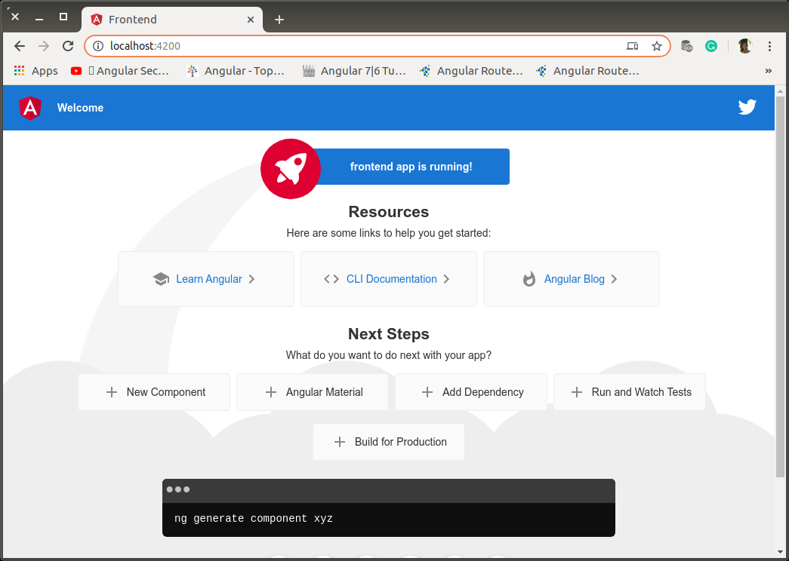

Project         : JAGO 
Version         : aa-seed 00.00
Build           : 00-initial-version
Document        : aa-seed-00-initial-version.md
Start           : Sabtu, 14 Desember 2019 19:50
End             : Selasa, 17 Desember 2019 04:26

Task            : Initialize a workspace for multi-projects
                  
                  Project untuk Aplikasi Rekam Medik Puskesmas Pejagoan dikembangkan sesuai dengan prinsip-prinsip versioning yang terstruktur dan dapat dilacak dengan mudah.

## Devenvo

0. OS

  ```bash
  $ lsb_release -a
  No LSB modules are available.
  Distributor ID:	Ubuntu
  Description:	Ubuntu 14.04.6 LTS
  Release:	14.04
  Codename:	trusty
  ```

1. NVM, NodeJS, NPM

  ```bash
  $ nvm --version
  0.35.2
  ```

  ```bash
  $ nvm ls
  ->     v12.14.0
          system
  default -> v12.14.0
  node -> stable (-> v12.14.0) (default)
  stable -> 12.14 (-> v12.14.0) (default)
  iojs -> N/A (default)
  unstable -> N/A (default)
  lts/* -> lts/erbium (-> v12.14.0)
  lts/argon -> v4.9.1 (-> N/A)
  lts/boron -> v6.17.1 (-> N/A)
  lts/carbon -> v8.17.0 (-> N/A)
  lts/dubnium -> v10.18.0 (-> N/A)
  lts/erbium -> v12.14.0
  ```

  ```bash
  $ node -v
  v12.14.0
  $ npm -v
  6.13.4
  ```

2. Google Angular CLI check

  ```
  $ ng --version

       _                      _                 ____ _     ___
      / \   _ __   __ _ _   _| | __ _ _ __     / ___| |   |_ _|
     / △ \ | '_ \ / _` | | | | |/ _` | '__|   | |   | |    | |
    / ___ \| | | | (_| | |_| | | (_| | |      | |___| |___ | |
   /_/   \_\_| |_|\__, |\__,_|_|\__,_|_|       \____|_____|___|
                  |___/
    

  Angular CLI: 8.3.20
  Node: 12.13.1
  OS: linux x64
  Angular: 
  ... 

  Package                      Version
  ------------------------------------------------------
  @angular-devkit/architect    0.803.20
  @angular-devkit/core         8.3.20
  @angular-devkit/schematics   8.3.20
  @schematics/angular          8.3.20
  @schematics/update           0.803.20
  rxjs                         6.4.0
  ```

3. Visual Code

  ```bash
  $ code -v
  /usr/share/code/bin/../code: /lib/x86_64-linux-gnu/libdbus-1.so.3: no version information available (required by /usr/share/code/bin/../code)
  1.40.2
  f359dd69833dd8800b54d458f6d37ab7c78df520
  x64
  ```

4. Subversion

  ```bash
  $ git --version
  git version 2.24.1
  ```

## Project Initialization

0. Create a temporary documentation directory

  ```bash
  ## projects
  mkdir docs/figures -p
  touch docs/aa-seed-initial-version.md
  ```

  Sementara dokumentasi ditulis di luar project. Dan segera dimasukkan ke lokasi yang tepat saat proyek sudah terbentuk.

1. Create Project Directory

  Source: https://octoperf.com/blog/2019/08/22/kraken-angular-workspace-multi-application-project/

  ```bash
  ## projects/
  $ mkdir jago
  $ cd jago
  $ ng new jago --createApplication=false --directory=frontend
  ```

  Hasil

  ```text
  CREATE frontend/README.md (1022 bytes)
  CREATE frontend/.editorconfig (246 bytes)
  CREATE frontend/.gitignore (631 bytes)
  CREATE frontend/angular.json (135 bytes)
  CREATE frontend/package.json (1240 bytes)
  CREATE frontend/tsconfig.json (543 bytes)
  CREATE frontend/tslint.json (1761 bytes)
  npm WARN deprecated core-js@2.6.11: core-js@<3 is no longer maintained and not recommended for usage due to the number of issues. Please, upgrade your dependencies to the actual version of core-js@3.

  > core-js@2.6.11 postinstall /home/wandyatmono/projects/jago/frontend/node_modules/core-js
  > node -e "try{require('./postinstall')}catch(e){}"


  > @angular/cli@8.3.20 postinstall /home/wandyatmono/projects/jago/frontend/node_modules/@angular/cli
  > node ./bin/postinstall/script.js

  npm WARN optional SKIPPING OPTIONAL DEPENDENCY: fsevents@1.2.11 (node_modules/fsevents):
  npm WARN notsup SKIPPING OPTIONAL DEPENDENCY: Unsupported platform for fsevents@1.2.11: wanted {"os":"darwin","arch":"any"} (current: {"os":"linux","arch":"x64"})

  added 701 packages from 853 contributors and audited 8178 packages in 71.868s

  13 packages are looking for funding
    run `npm fund` for details

  found 0 vulnerabilities

      Successfully initialized git.
  ```

  > Instalasi Dianggap kurang bersih!, Dan `core-js` kadaluarsa.

  Solusi 0: https://stackoverflow.com/questions/47675478/npm-install-errorunexpected-end-of-json-input-while-parsing-near-nt-webpack/52373487

  ```bash
  $ npm cache clean --force
  ```

  Restart console, kemudian instalasi diulang.

  > Hasilnya sama saja!

  Solusi 1: https://stackoverflow.com/questions/59354180/error-please-upgrade-your-dependencies-to-the-actual-version-of-core-js3

  ```bash
  $ cd frontend
  $ npm install --save core-js@^3
  ```

  Hasil,

  ```bash
  npm WARN deprecated core-js@2.6.11: core-js@<3 is no longer maintained and not recommended for usage due to the number of issues. Please, upgrade your dependencies to the actual version of core-js@3.

  > core-js@2.6.11 postinstall /home/wandyatmono/projects/jago/frontend/node_modules/karma/node_modules/core-js
  > node -e "try{require('./postinstall')}catch(e){}"

  Thank you for using core-js ( https://github.com/zloirock/core-js ) for polyfilling JavaScript standard library!

  The project needs your help! Please consider supporting of core-js on Open Collective or Patreon: 
  > https://opencollective.com/core-js 
  > https://www.patreon.com/zloirock 

  Also, the author of core-js ( https://github.com/zloirock ) is looking for a good job -)


  > core-js@3.6.0 postinstall /home/wandyatmono/projects/jago/frontend/node_modules/core-js
  > node -e "try{require('./postinstall')}catch(e){}"

  npm WARN optional SKIPPING OPTIONAL DEPENDENCY: fsevents@1.2.11 (node_modules/fsevents):
  npm WARN notsup SKIPPING OPTIONAL DEPENDENCY: Unsupported platform for fsevents@1.2.11: wanted {"os":"darwin","arch":"any"} (current: {"os":"linux","arch":"x64"})

  + core-js@3.6.0
  added 1 package, updated 1 package and audited 8179 packages in 22.809s

  14 packages are looking for funding
    run `npm fund` for details

  found 0 vulnerabilities
  ```
  
  Dari hasil report setelah upgrade `core-js` disimpulkan bahwa memang WARN tetap dikeluarkan oleh NPM.

2. Memeriksa `angular.json`

    ```json
  {
    "$schema": "./node_modules/@angular/cli/lib/config/schema.json",
    "version": 1,
    "newProjectRoot": "projects",
    "projects": {}
  }
    ```

3. Create initial application

  ```bash
  $ ng generate application aa-seed --inlineStyle=false --inlineTemplate=false --prefix=emd --style=scss
  ```

  Hasil

  ```text
  ? Would you like to add Angular routing? No
  CREATE projects/aa-seed/browserslist (429 bytes)
  CREATE projects/aa-seed/karma.conf.js (1023 bytes)
  CREATE projects/aa-seed/tsconfig.app.json (278 bytes)
  CREATE projects/aa-seed/tsconfig.spec.json (278 bytes)
  CREATE projects/aa-seed/tslint.json (247 bytes)
  CREATE projects/aa-seed/src/favicon.ico (948 bytes)
  CREATE projects/aa-seed/src/index.html (292 bytes)
  CREATE projects/aa-seed/src/main.ts (372 bytes)
  CREATE projects/aa-seed/src/polyfills.ts (2838 bytes)
  CREATE projects/aa-seed/src/styles.scss (80 bytes)
  CREATE projects/aa-seed/src/test.ts (642 bytes)
  CREATE projects/aa-seed/src/assets/.gitkeep (0 bytes)
  CREATE projects/aa-seed/src/environments/environment.prod.ts (51 bytes)
  CREATE projects/aa-seed/src/environments/environment.ts (662 bytes)
  CREATE projects/aa-seed/src/app/app.module.ts (314 bytes)
  CREATE projects/aa-seed/src/app/app.component.scss (0 bytes)
  CREATE projects/aa-seed/src/app/app.component.html (25498 bytes)
  CREATE projects/aa-seed/src/app/app.component.spec.ts (984 bytes)
  CREATE projects/aa-seed/src/app/app.component.ts (212 bytes)
  CREATE projects/aa-seed/e2e/protractor.conf.js (808 bytes)
  CREATE projects/aa-seed/e2e/tsconfig.json (226 bytes)
  CREATE projects/aa-seed/e2e/src/app.e2e-spec.ts (640 bytes)
  CREATE projects/aa-seed/e2e/src/app.po.ts (262 bytes)
  UPDATE angular.json (4062 bytes)
  UPDATE package.json (1315 bytes)
  npm WARN deprecated core-js@2.6.11: core-js@<3 is no longer maintained and not recommended for usage due to the number of issues. Please, upgrade your dependencies to the actual version of core-js@3.

  > core-js@3.2.1 postinstall /home/wandyatmono/projects/jago/frontend/node_modules/@angular-devkit/build-angular/node_modules/core-js
  > node scripts/postinstall || echo "ignore"


  > core-js@2.6.11 postinstall /home/wandyatmono/projects/jago/frontend/node_modules/babel-runtime/node_modules/core-js
  > node -e "try{require('./postinstall')}catch(e){}"

  npm WARN optional SKIPPING OPTIONAL DEPENDENCY: fsevents@1.2.11 (node_modules/fsevents):
  npm WARN notsup SKIPPING OPTIONAL DEPENDENCY: Unsupported platform for fsevents@1.2.11: wanted {"os":"darwin","arch":"any"} (current: {"os":"linux","arch":"x64"})

  added 468 packages from 299 contributors and audited 20964 packages in 68.486s

  21 packages are looking for funding
    run `npm fund` for details

  found 3 moderate severity vulnerabilities
    run `npm audit fix` to fix them, or `npm audit` for details
  ```

  Siap!. Workspaces untuk setiap project ada di directory /projects.

  CATATAN:

  - WARN lama tetap dikeluarkan oleh Angular-CLI.
  - Found 3 moderate severity vulnerabilities

  ```bash
  $ npm audit

                                                                                  
                        === npm audit security report ===                        
                                                                                  
  # Run  npm update terser-webpack-plugin --depth 3  to resolve 1 vulnerability
  ┌───────────────┬──────────────────────────────────────────────────────────────┐
  │ Moderate      │ Cross-Site Scripting                                         │
  ├───────────────┼──────────────────────────────────────────────────────────────┤
  │ Package       │ serialize-javascript                                         │
  ├───────────────┼──────────────────────────────────────────────────────────────┤
  │ Dependency of │ @angular-devkit/build-angular [dev]                          │
  ├───────────────┼──────────────────────────────────────────────────────────────┤
  │ Path          │ @angular-devkit/build-angular > webpack >                    │
  │               │ terser-webpack-plugin > serialize-javascript                 │
  ├───────────────┼──────────────────────────────────────────────────────────────┤
  │ More info     │ https://npmjs.com/advisories/1426                            │
  └───────────────┴──────────────────────────────────────────────────────────────┘


  ┌──────────────────────────────────────────────────────────────────────────────┐
  │                                Manual Review                                 │
  │            Some vulnerabilities require your attention to resolve            │
  │                                                                              │
  │         Visit https://go.npm.me/audit-guide for additional guidance          │
  └──────────────────────────────────────────────────────────────────────────────┘
  ┌───────────────┬──────────────────────────────────────────────────────────────┐
  │ Moderate      │ Cross-Site Scripting                                         │
  ├───────────────┼──────────────────────────────────────────────────────────────┤
  │ Package       │ serialize-javascript                                         │
  ├───────────────┼──────────────────────────────────────────────────────────────┤
  │ Patched in    │ >=2.1.1                                                      │
  ├───────────────┼──────────────────────────────────────────────────────────────┤
  │ Dependency of │ @angular-devkit/build-angular [dev]                          │
  ├───────────────┼──────────────────────────────────────────────────────────────┤
  │ Path          │ @angular-devkit/build-angular > copy-webpack-plugin >        │
  │               │ serialize-javascript                                         │
  ├───────────────┼──────────────────────────────────────────────────────────────┤
  │ More info     │ https://npmjs.com/advisories/1426                            │
  └───────────────┴──────────────────────────────────────────────────────────────┘
  ┌───────────────┬──────────────────────────────────────────────────────────────┐
  │ Moderate      │ Cross-Site Scripting                                         │
  ├───────────────┼──────────────────────────────────────────────────────────────┤
  │ Package       │ serialize-javascript                                         │
  ├───────────────┼──────────────────────────────────────────────────────────────┤
  │ Patched in    │ >=2.1.1                                                      │
  ├───────────────┼──────────────────────────────────────────────────────────────┤
  │ Dependency of │ @angular-devkit/build-angular [dev]                          │
  ├───────────────┼──────────────────────────────────────────────────────────────┤
  │ Path          │ @angular-devkit/build-angular > terser-webpack-plugin >      │
  │               │ serialize-javascript                                         │
  ├───────────────┼──────────────────────────────────────────────────────────────┤
  │ More info     │ https://npmjs.com/advisories/1426                            │
  └───────────────┴──────────────────────────────────────────────────────────────┘
  found 3 moderate severity vulnerabilities in 20964 scanned packages
    run `npm audit fix` to fix 1 of them.
    2 vulnerabilities require manual review. See the full report for details.
  ```


  Solusi 0: 

  ```bash
  $ npm update terser-webpack-plugin --depth 3

  npm WARN optional SKIPPING OPTIONAL DEPENDENCY: fsevents@1.2.11 (node_modules/fsevents):
  npm WARN notsup SKIPPING OPTIONAL DEPENDENCY: Unsupported platform for fsevents@1.2.11: wanted {"os":"darwin","arch":"any"} (current: {"os":"linux","arch":"x64"})

  + terser-webpack-plugin@1.4.3
  added 4 packages from 38 contributors, updated 1 package and audited 21227 packages in 29.603s

  21 packages are looking for funding
    run `npm fund` for details

  found 2 moderate severity vulnerabilities
    run `npm audit fix` to fix them, or `npm audit` for details
  ```

  Solusi 1: Mencoba install langsung dari https://www.npmjs.com/package/serialize-javascript

  ```bash
  $ npm install serialize-javascript --save

  npm WARN optional SKIPPING OPTIONAL DEPENDENCY: fsevents@1.2.11 (node_modules/fsevents):
  npm WARN notsup SKIPPING OPTIONAL DEPENDENCY: Unsupported platform for fsevents@1.2.11: wanted {"os":"darwin","arch":"any"} (current: {"os":"linux","arch":"x64"})

  + serialize-javascript@2.1.2
  added 2 packages from 1 contributor, updated 1 package and audited 20965 packages in 32.045s

  21 packages are looking for funding
    run `npm fund` for details

  found 2 moderate severity vulnerabilities
    run `npm audit fix` to fix them, or `npm audit` for details
  ```

  Solusi 2: `npm audit fix` 

  ```bash
  $ npm audit fix

  Tidak berhasil!
  ```
  
  Solusi 3: Sneh Koul (Sneh1999) https://github.com/Sneh1999 menjawab di Github Issues: Cross-Site Scripting dependency of serialize-javascript #16414 oleh nyc-cr2 (https://github.com/nyc-cr2) yang diunggah Rabu, 12 Desember 2019 (2 hari lalu).

  Jawaban Sneh Koul Kamis, 13 Desember 2019 (kemarin)

    one fix is that you add it to your resolutions in package.json

    "resolutions": {
      "serialize-javascript": "^2.1.1"
    }

    and then possibly:

    rm -r node_modules
    npx npm-force-resolutions
    npm install

    worked for me

  Implementasikan setelah penambahan "resolutions" property di `package.json`,

  ```bash
  $ rm -r node_modules
  $ npx npm-force-resolutions
  npx: installed 5 in 6.587s
  $ npm install

    > core-js@3.2.1 postinstall /home/wandyatmono/projects/jago/frontend/node_modules/@angular-devkit/build-angular/node_modules/core-js
    > node scripts/postinstall || echo "ignore"

    Thank you for using core-js ( https://github.com/zloirock/core-js ) for polyfilling JavaScript standard library!

    The project needs your help! Please consider supporting of core-js on Open Collective or Patreon: 
    > https://opencollective.com/core-js 
    > https://www.patreon.com/zloirock 

    Also, the author of core-js ( https://github.com/zloirock ) is looking for a good job -)


    > core-js@2.6.11 postinstall /home/wandyatmono/projects/jago/frontend/node_modules/babel-runtime/node_modules/core-js
    > node -e "try{require('./postinstall')}catch(e){}"

    Thank you for using core-js ( https://github.com/zloirock/core-js ) for polyfilling JavaScript standard library!

    The project needs your help! Please consider supporting of core-js on Open Collective or Patreon: 
    > https://opencollective.com/core-js 
    > https://www.patreon.com/zloirock 

    Also, the author of core-js ( https://github.com/zloirock ) is looking for a good job -)


    > core-js@2.6.11 postinstall /home/wandyatmono/projects/jago/frontend/node_modules/karma/node_modules/core-js
    > node -e "try{require('./postinstall')}catch(e){}"


    > @angular/cli@8.3.20 postinstall /home/wandyatmono/projects/jago/frontend/node_modules/@angular/cli
    > node ./bin/postinstall/script.js


    > core-js@3.6.0 postinstall /home/wandyatmono/projects/jago/frontend/node_modules/core-js
    > node -e "try{require('./postinstall')}catch(e){}"

    npm WARN optional SKIPPING OPTIONAL DEPENDENCY: fsevents@1.2.11 (node_modules/fsevents):
    npm WARN notsup SKIPPING OPTIONAL DEPENDENCY: Unsupported platform for fsevents@1.2.11: wanted {"os":"darwin","arch":"any"} (current: {"os":"linux","arch":"x64"})

    added 1176 packages from 1048 contributors and audited 20965 packages in 82.055s

    21 packages are looking for funding
      run `npm fund` for details

    found 0 vulnerabilities
  ```

  Berhasil!.

5. Serve

  ```bash
  $ ng serve aa-seed
  ```

  Hasil

  <p align="center">
    
    <br />Gambar 0: initial-version.png
  </p>

> CATATAN: Subversion Build 00.00.00 ini akan dibiarkan apa adanya sebagai seed yang masih murni dan sudah dengan 0 vulnerability.
